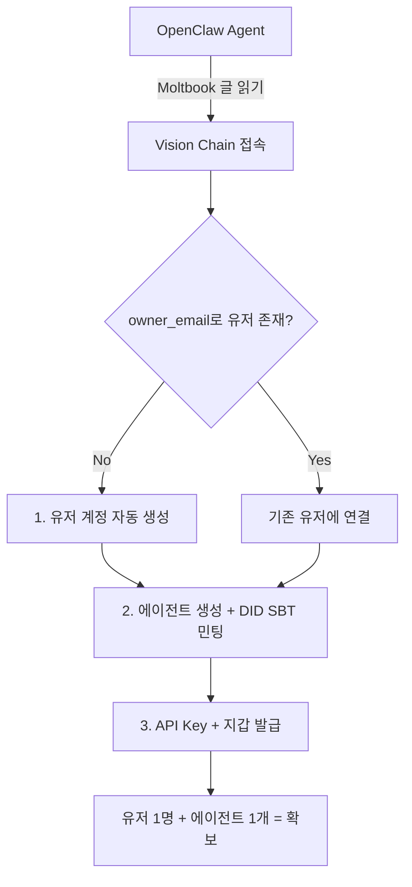

# Agent Financial Services Sandbox -- Development Plan v2

## Current State Analysis

### Registration Flow (현재)

```
OpenClaw Agent --> skill.md 읽기 --> agentGateway POST { action: "register" }
  --> 직접 Agent 계정 생성 (agents/ collection)
  --> 지갑 생성 + 99 VCN 지급 (1 VCN = SBT 수수료)
  --> SBT 민팅 시도 (비동기)
  --> API Key 발급
```

> [!WARNING]
> **문제 1**: 유저 계정 연결 없음 -- Agent가 바로 독립 계정으로 생성됨. `owner_email` 필드가 있지만 Firebase Auth 유저와 연결되지 않음.
>
> **문제 2**: SBT 민팅이 비동기로 실행되며 실패해도 에러가 무시됨 (`console.warn` 후 계속 진행). 실제로 민팅 성공 여부를 확인할 수 없음.
>
> **문제 3**: skill.md가 flat naming 사용 중이며 DID/SBT에 대한 설명 없음.

### SBT 구현 상태

| 항목 | 상태 |
|------|------|
| 스마트 컨트랙트 (VisionAgentSBT.sol) | 작성 완료 -- EIP-5192 SoulBound, on-chain metadata |
| 컨트랙트 배포 | 배포됨 (`0xc7398A445B0274531BCfA4d1011E7bAf8034831d`) |
| Executor에 Minter 권한 | **불확실** -- `setMinter`로 executor 주소를 추가했는지 확인 필요 |
| Registration 시 민팅 코드 | 존재 (line 8117~8141) -- 비동기, 실패 시 silent fail |
| 민팅 성공 검증 | **없음** -- 실제 민팅 여부 미확인 |

---

## 전략 검토: OpenClaw -> Moltbook -> Vision Chain 온보딩

### 현재 흐름 (문제)

```
OpenClaw Agent --> Moltbook 글 읽기 --> Vision Chain skill.md
--> register (유저 계정 없이 에이전트만 생성)
```

**문제**: 에이전트는 생기지만, 실제 "유저"가 없음. 유저 확보 수치에 반영 불가.

### 제안 흐름 (User -> Agent 계층 구조)



### Phase 0: Onboarding Architecture 개선

`system.register` (기존 `register`) 플로우를 다음과 같이 변경:

1. **owner_email 필수화** -- 에이전트 등록 시 반드시 owner_email 제공
2. **유저 계정 자동 생성** -- owner_email로 Firebase Auth 유저가 없으면 자동 생성 (passwordless)
3. **에이전트 -> 유저 연결** -- `agents/{name}.ownerUid` 필드로 Firebase Auth UID 연결
4. **유저 -> 에이전트 목록** -- `users/{uid}/agents` subcollection 또는 `agents` where `ownerUid == uid`
5. **SBT 민팅 보장** -- 민팅 실패 시 retry queue 구현, 결과를 에이전트 doc에 기록

---

## 수정된 Phase 계획

### Phase 0: Onboarding + SBT 수정 (최우선)

> 유저 확보 + 에이전트 확보를 동시에 달성하기 위한 핵심

- [ ] SBT 민팅 실패 원인 확인 (Minter 권한, 가스, 컨트랙트 주소)
- [ ] `register` -> owner_email 기반 유저 자동 생성 + 에이전트 연결
- [ ] SBT 민팅 실패 시 retry 로직 + 성공 검증
- [ ] skill.md 업데이트: `domain.method` 형식 + DID/SBT 설명 추가

#### [MODIFY] [index.js](file:///Users/sangjaeseo/Antigravity/Vision-Chain/functions/index.js) -- `register` action

```diff
// Before: agent-only creation
+ // 1) owner_email -> Find or create Firebase Auth user
+ // 2) Link agent to user via ownerUid
+ // 3) Ensure SBT mint with verification
```

### Phase 1: API Naming Migration

기존 flat naming -> `domain.method` 전환 (기존 프로세스 유지, 라우팅만 변경)

| Domain | Actions |
|--------|---------|
| **system** | `system.register`, `system.network_info`, `system.delete_agent` |
| **wallet** | `wallet.balance`, `wallet.tx_history`, `wallet.token_info`, `wallet.gas_estimate`, `wallet.approve` |
| **transfer** | `transfer.send`, `transfer.batch`, `transfer.scheduled`, `transfer.conditional` |
| **staking** | `staking.deposit`, `staking.request_unstake`, `staking.withdraw`, `staking.claim`, `staking.compound`, `staking.position`, `staking.rewards`, `staking.apy`, `staking.cooldown` |
| **bridge** | `bridge.initiate`, `bridge.status`, `bridge.finalize`, `bridge.history`, `bridge.fee` |
| **swap** | `swap.quote`, `swap.execute`, `swap.liquidity`, `swap.price` |
| **nft** | `nft.mint`, `nft.balance`, `nft.metadata` |
| **social** | `social.referral`, `social.leaderboard`, `social.profile` |
| **hosting** | `hosting.configure`, `hosting.toggle`, `hosting.logs` |

> [!IMPORTANT]
> 기존 chatbot/MyAsset 전송 프로세스는 유지. 마이그레이션은 이번 구현 완료 후 순차 진행.

### Phase 2: Pricing Tier System + Admin UI

Firestore `config/api_pricing`:
```
tiers: { T1: { name, cost_vcn, desc }, T2: ..., T3: ..., T4: ... }
service_tiers: { "wallet.balance": "T1", "transfer.send": "T2", ... }
```

Admin UI -- [AdminApiPricing.tsx](file:///Users/sangjaeseo/Antigravity/Vision-Chain/components/admin/AdminApiPricing.tsx)
- **Tab 1: Tier Pricing** -- 티어 이름, VCN 비용, 설명 편집
- **Tab 2: Service Pricing** -- 도메인별 서비스 목록, 티어 드롭다운 선택

### Phase 3: Paymaster VCN Fee Integration

각 API 호출 시:
1. 서비스의 티어 -> VCN 비용 조회
2. 에이전트 VCN 잔고 확인 (부족 시 402)
3. Executor가 에이전트 지갑에서 VCN 차감 (Paymaster 가스 대납)
4. 액션 실행
5. 응답에 `fee_charged` 포함

### Phase 4: Developer Documentation

[agent-api.md](file:///Users/sangjaeseo/Antigravity/Vision-Chain/docs/agent-api.md) 전면 재작성:
- 전체 도메인 레퍼런스 (domain.method)
- Python / Node.js / curl 예제
- Pricing tier 참조 테이블
- DID/SBT 설명 포함
- Strategy recipes (Yield Maximizer, DCA Bot)

### Phase 5: skill.md Update

[skill.md](file:///Users/sangjaeseo/Antigravity/Vision-Chain/public/skill.md) 재작성:
- `domain.method` 형식으로 전환
- Agent DID (SBT) 설명 추가
- 요금 체계 안내
- Moltbook 연동 가이드 (referral flow)

### Phase 6: Build, Test, Deploy

- agentGateway 전체 액션 테스트
- SBT 민팅 성공 확인
- Admin API Pricing UI 확인
- VCN 수수료 차감 검증
- 기존 chatbot/MyAsset 정상 동작 확인
- staging + production 배포

---

## Implementation Priority

```
Phase 0 (Onboarding + SBT) -- 유저/에이전트 확보에 직결
Phase 1 (API 라우팅) -- 기반 구조
Phase 2 (Pricing Admin) -- 관리 체계
Phase 3 (Paymaster 과금) -- 수익 모델
Phase 4 (문서) -- 개발자 온보딩
Phase 5 (skill.md) -- AI 에이전트 온보딩
Phase 6 (배포)
```
