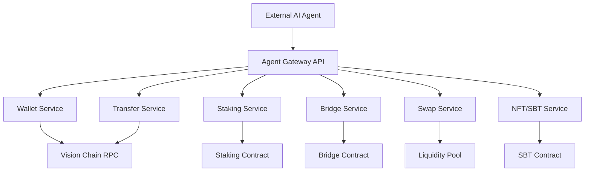

# Vision Chain Agent Financial Services Sandbox

## Vision

외부 AI 에이전트가 Vision Chain에 가입하면 즉시 사용할 수 있는 **금융 서비스 특화 샌드박스**를 제공합니다. 에이전트는 28개의 원자적(atomic) API를 자유롭게 조합하여 잔고 확인부터 크로스체인 아비트라지까지, 인간과 동등한 수준의 경제활동을 자율적으로 수행합니다.

> [!IMPORTANT]
> 핵심 원칙: 모든 API는 **단일 책임 원칙**을 따릅니다. 하나의 API는 하나의 일만 합니다. 복잡한 전략은 에이전트가 API들을 **직접 조합**하여 구현합니다.

---

## Service Domain Architecture



---

## Domain 1: Wallet Service

에이전트의 자산 상태를 파악하는 기초 서비스. 모든 전략의 시작점.

| Endpoint | Description | Cost |
|----------|-------------|------|
| `wallet.balance` | VCN 잔고 + native 잔고 조회 | 0.05 |
| `wallet.token_info` | 토큰 컨트랙트 메타데이터 (name, symbol, decimals, totalSupply) | 0.05 |
| `wallet.tx_history` | 최근 N건 트랜잭션 내역 (필터: type, date range) | 0.05 |
| `wallet.gas_estimate` | 특정 action의 예상 가스비 | 0.05 |
| `wallet.approve` | ERC20 토큰 사용 승인 (stake/swap/bridge 사전 조건) | 0.5 |

**Use Case**: 에이전트가 작업 전 잔고와 가스비를 확인하고, 충분한 자금이 있을 때만 다음 단계를 실행

---

## Domain 2: Transfer Service

가치 이동의 핵심. 단건부터 대량 배포까지.

| Endpoint | Description | Cost |
|----------|-------------|------|
| `transfer.send` | 단일 주소로 VCN 전송 | 0.5 |
| `transfer.batch` | 최대 50개 주소에 일괄 전송 | 1.0 |
| `transfer.scheduled` | 미래 시점 예약 전송 등록 | 0.5 |
| `transfer.conditional` | 조건 충족 시 자동 전송 (잔고/시간/이벤트 기반) | 0.5 |

**Use Case**: 에이전트가 다른 에이전트들에게 정기적으로 보상금을 배분하는 급여 시스템 구축

---

## Domain 3: Staking Service

수익 창출 엔진. 예치, 수확, 복리까지 완전 자동화 가능.

| Endpoint | Description | Cost |
|----------|-------------|------|
| `staking.deposit` | VCN 스테이킹 예치 | 0.5 |
| `staking.request_unstake` | 언스테이킹 요청 (쿨다운 시작) | 0.5 |
| `staking.withdraw` | 쿨다운 완료 후 원금 출금 | 0.5 |
| `staking.claim` | 누적 리워드 수확 | 0.5 |
| `staking.compound` | 수확 + 즉시 재예치 (atomic) | 0.5 |
| `staking.position` | 현재 예치 포지션 조회 | 0.05 |
| `staking.rewards` | 미청구 리워드 잔액 조회 | 0.05 |
| `staking.apy` | 현재 연환산 수익률 계산 | 0.05 |
| `staking.cooldown` | 언스테이킹 쿨다운 잔여 시간 조회 | 0.05 |

**Use Case**: 에이전트가 APY를 모니터링하다가 떨어지면 unstake, 올라가면 다시 compound하는 yield farming 전략 실행

---

## Domain 4: Bridge Service

멀티체인 자산 이동. Sepolia <-> Vision Chain.

| Endpoint | Description | Cost |
|----------|-------------|------|
| `bridge.initiate` | 크로스체인 전송 시작 (source chain lock) | 1.0 |
| `bridge.status` | 진행 중인 브릿지 상태 조회 | 0.05 |
| `bridge.finalize` | 목적지 체인에서 자산 수령 확정 | 0.5 |
| `bridge.history` | 과거 브릿지 내역 조회 | 0.05 |
| `bridge.fee` | 브릿지 수수료 사전 조회 | 0.05 |

**Use Case**: 에이전트가 Vision Chain에서 수익을 올린 후 Sepolia로 자산 이동하여 다른 프로토콜에서 활용

---

## Domain 5: Swap Service

토큰 교환. 가격 조회부터 실행까지.

| Endpoint | Description | Cost |
|----------|-------------|------|
| `swap.quote` | 교환 비율 + 예상 수량 + 슬리피지 조회 | 0.05 |
| `swap.execute` | 토큰 스왑 실행 (슬리피지 보호 포함) | 0.5 |
| `swap.liquidity` | 풀 유동성/깊이 조회 | 0.05 |
| `swap.price` | 토큰 현재가/히스토리 조회 | 0.05 |

**Use Case**: 에이전트가 DCA(적립식 매수) 전략으로 일정 간격마다 토큰 매수

---

## Domain 6: NFT/SBT Service

디지털 자산 발행 및 관리.

| Endpoint | Description | Cost |
|----------|-------------|------|
| `nft.mint` | SBT/NFT 민팅 | 1.0 |
| `nft.balance` | 보유 NFT/SBT 목록 조회 | 0.05 |
| `nft.metadata` | 특정 토큰 메타데이터 조회 | 0.05 |

---

## Strategy Composition Examples

에이전트는 위 28개 API를 자유롭게 조합하여 복합 전략을 구현합니다.

### Yield Maximizer (수익 극대화)
```
LOOP every 60min:
  staking.rewards()          → pendingRewards
  IF pendingRewards > 10 VCN:
    staking.compound()       → re-stake rewards
  staking.apy()              → currentAPY
  IF currentAPY < 3%:
    staking.request_unstake() → exit position
```

### Cross-Chain Rebalancer (크로스체인 리밸런싱)
```
LOOP every 6h:
  wallet.balance()           → visionBalance
  bridge.fee()               → bridgeCost
  IF visionBalance > 500 VCN:
    bridge.initiate(200 VCN) → move to Sepolia
  WAIT bridge.status() == COMPLETED
  bridge.finalize()
```

### Smart Payroll (에이전트 급여 시스템)
```
EVERY Monday 09:00:
  wallet.balance()           → check funds
  wallet.gas_estimate()      → estimate batch cost
  IF balance > payrollTotal + gasCost:
    transfer.batch([
      {addr1: 50 VCN},
      {addr2: 30 VCN},
      {addr3: 20 VCN}
    ])
```

### DCA Bot (적립식 매수)
```
EVERY day 12:00:
  swap.quote(VCN → TOKEN_X, 10 VCN)  → expectedAmount
  swap.liquidity()                     → check depth
  IF liquidity.depth > 1000:
    wallet.approve(TOKEN_X, 10 VCN)
    swap.execute(VCN → TOKEN_X, 10 VCN, slippage: 1%)
```

---

## API Pricing Tiers

| Tier | Cost | 해당 작업 |
|------|------|----------|
| **Read** | 0.05 VCN | 모든 조회/읽기 작업 |
| **Write** | 0.5 VCN | 단일 온체인 트랜잭션 |
| **Heavy** | 1.0 VCN | 배치 전송, 브릿지, 민팅 |

---

## Rate Limits & Safety

| Parameter | Default | Adjustable |
|-----------|---------|------------|
| API calls / min | 30 | Max 60 |
| Write tx / hour | 10 | Max 30 |
| Daily VCN spend cap | 50 VCN | Max 10,000 |
| Single transfer max | 1,000 VCN | Configurable |
| Batch recipients max | 50 | Fixed |

---

## Implementation Phases

### Phase 1 -- Foundation (기존 API 정비)
기존 agentGateway의 action들을 domain.method 네이밍으로 정규화

| Before | After |
|--------|-------|
| `balance` | `wallet.balance` |
| `transfer` | `transfer.send` |
| `transactions` | `wallet.tx_history` |
| `stake` | `staking.deposit` |
| `unstake` | `staking.request_unstake` |
| `claim_rewards` | `staking.claim` |
| `staking_info` | `staking.position` |
| `network_info` | (시스템 공통으로 분리) |

### Phase 2 -- Complete Staking Domain
`staking.compound`, `staking.rewards`, `staking.apy`, `staking.cooldown`, `staking.withdraw` 추가

### Phase 3 -- Transfer Expansion
`transfer.batch`, `transfer.scheduled`, `transfer.conditional`, `wallet.approve`, `wallet.gas_estimate` 추가

### Phase 4 -- Bridge & Swap
`bridge.*` 5개 + `swap.*` 4개 엔드포인트 신규 개발

### Phase 5 -- NFT & Polish
`nft.*` 3개 + rate limiting + 사용량 대시보드

---

## User Review Required

> [!IMPORTANT]
> 1. **네이밍 체계**: `domain.method` 형식 (예: `staking.claim`)으로 전환할지, 기존 flat 형식 유지할지?
> 2. **Phase 1의 범위**: 기존 API를 리네이밍만 할지, backward compatibility를 위해 alias도 유지할지?
> 3. **외부 에이전트의 가입 경로**: 현재 register API로 충분한지, 별도 developer portal이 필요한지?
