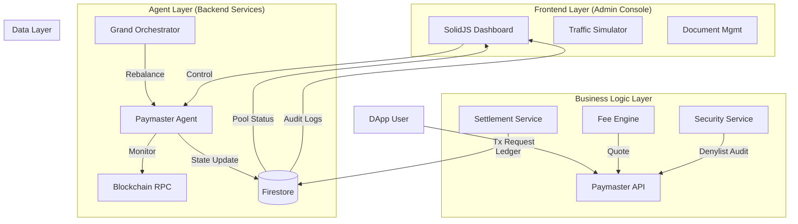

# Vision Chain Grand Paymaster: System Architecture Analysis

## 1. Overview
The **Grand Paymaster System** is the core infrastructure responsible for Vision Chain's "Gasless Experience" and "Autonomous Operations." This system is designed to simultaneously achieve **User Convenience** (Zero Gas), **Operational Efficiency** (AI Agent), and **Profitability** (Fee Logic).

## 2. High-Level Architecture Diagram

## 3. Core Component Analysis

### 3.1. Frontend Layer: Admin Console (`/components/admin`)
*   **Tech Stack**: SolidJS, TailwindCSS, Lucide Icons.
*   **Role**: The Control Tower of the system. It is not just a viewer but an active UI that issues simulation and control commands.
*   **Key Modules**:
    *   **`PaymasterAdmin.tsx`**: Real-time dashboard. Run `PaymasterAgent` instances directly within the browser to perform live simulations.
    *   **`AdminDocuments.tsx`**: Operations manual and technical documentation management (Firestore integration).
    *   **Reactive State**: Utilizes `createSignal` and `createEffect` to ensure the UI reacts immediately to backend data changes.

### 3.2. Agent Layer: Autonomous Operations (`/services/paymaster`)
*   **`PaymasterAgent.ts` (State Machine)**:
    *   An independent agent is assigned to each chain (Pool).
    *   **Self-Healing Loop**: 
        1. **Monitor**: Periodically checks RPC status, Gas Price, and Pool Balance (every 3 seconds).
        2. **Analyze**: Determines if thresholds have been breached.
        3. **Act**: Automatically transitions states, e.g., `NORMAL` → `SAFE_MODE` (Low Balance) → `THROTTLED` (Traffic Surge).
    *   **Adapter Pattern**: Injects DB dependencies via `FirestoreAdapter` to flexibly switch between test environments (Mock) and production environments (Real DB).

*   **`GrandOrchestrator.ts` (Global Manager)**:
    *   Orchestrates Paymaster Agents scattered across multiple chains.
    *   **Rebalancing**: Simulates logic to move funds from chains with surplus or the central Vault to chains with insufficient balances.

### 3.3. Business Logic Layer (`/services/paymaster`)
*   **`FeeEngine.ts` (Pricing Strategy)**:
    *   Dynamic Fee Calculation: `Base Fee` * `Buffer(5%)` + `Surcharge(20~50%)`.
    *   Goes beyond simple gas sponsorship to guarantee the **Revenue Stream** of the Vision Chain Foundation.
*   **`SettlementService.ts` (Accounting)**:
    *   **Reconciliation**: Calculates the difference between (Estimated Gas - Actual Gas) and records refund or additional charge events in the Ledger.
    *   **Audit Trail**: All fund flows are recorded as immutable logs in the `paymaster_ledger` collection.

### 3.4. Security Layer
*   **`TSSManager.ts` (Key Management)**:
    *   Architecturally adopted **MPC (Multi-Party Computation)** based signing to eliminate the risk of single private key usage. (Currently Mock implementation).
*   **`SecurityService.ts`**:
    *   **Denylist**: Real-time blocking of malicious DApps or abusive users.
    *   **Velocity Check**: Automatically switches to `THROTTLED` state to protect assets if too many requests are received in a short period.

## 4. Data Architecture (Firestore Schema)

| Collection | Role | Key Fields |
| :--- | :--- | :--- |
| **`paymaster_pools`** | System Status | `chainId`, `mode` (NORMAL/SAFE...), `balance`, `updatedAt` |
| **`paymaster_ledger`** | Accounting Ledger | `quoteId`, `revenue`, `finalCost`, `timestamp` |
| **`system_documents`** | Knowledge Base | `title`, `content`, `category`, `attachments` |
| **`audit_trails`** | Audit Log | `adminId`, `action`, `changes`, `timestamp` |

## 5. Key Advantages

1.  **Resilience**: Even without 24/7 admin monitoring, the Agent detects low balances or RPC errors and automatically switches to 'Safe Mode' to prevent accidents.
2.  **Testability**: The `FirestoreAdapter` pattern allows for script-based verification of complex scenarios (balance depletion, gas spikes, etc.) without a real DB.
3.  **Scalability**: Designed with a "1 Chain = 1 Agent" structure, enabling immediate response by simply adding agents even as Vision Chain expands to dozens of L2/L3s.

## 6. Conclusion
The currently implemented system goes beyond a simple MVP and possesses an **enterprise-grade architecture designed for mainnet operations**. In particular, the **"Autonomous Paymaster"** model, where the Frontend (Admin) and Backend (Agent) are organically integrated, is a leading approach in the industry.
