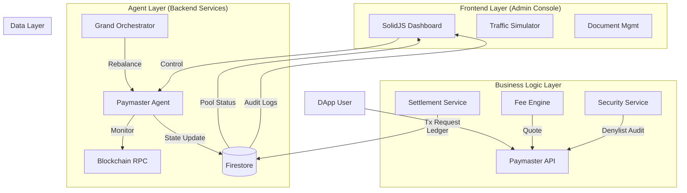

# Vision Chain Grand Paymaster: 시스템 아키텍처 분석

## 1. 개요 (Overview)
**Grand Paymaster System**은 Vision Chain의 "가스비 대납(Gasless)" 및 "자율 운영(Autonomous Ops)"을 담당하는 핵심 인프라입니다. 이 시스템은 **사용자 편의성**(Zero Gas), **운영 효율성**(AI Agent), **수익성**(Fee Logic)을 동시에 달성하도록 설계되었습니다.

## 2. 전체 아키텍처 다이어그램 (High-Level Architecture)

## 3. 핵심 컴포넌트 분석

### 3.1. Frontend Layer: Admin Console (`/components/admin`)
*   **Tech Stack**: SolidJS, TailwindCSS, Lucide Icons.
*   **역할**: 시스템의 관제탑(Control Tower). 단순한 뷰어가 아니라 시뮬레이션 및 제어 명령을 내리는 능동형 UI입니다.
*   **주요 모듈**:
    *   **`PaymasterAdmin.tsx`**: 실시간 대시보드. 에이전트(`PaymasterAgent`) 인스턴스를 브라우저 내에서 직접 구동하여 라이브 시뮬레이션을 수행합니다.
    *   **`AdminDocuments.tsx`**: 운영 매뉴얼 및 기술 문서 관리 (Firestore 연동).
    *   **Reactive State**: `createSignal`, `createEffect`를 활용하여 백엔드 데이터 변경 시 UI가 즉시 반응합니다.

### 3.2. Agent Layer: Autonomous Operations (`/services/paymaster`)
*   **`PaymasterAgent.ts` (State Machine)**:
    *   각 체인(Pool)마다 독립된 에이전트가 할당됩니다.
    *   **Self-Healing Loop**: 
        1. **Monitor**: RPC 상태, 가스비(Gas Price), 풀 잔고(Balance)를 주기적으로(3초) 확인.
        2. **Analyze**: 임계값(Threshold) 위반 여부 판단.
        3. **Act**: `NORMAL` → `SAFE_MODE` (잔고 부족 시) → `THROTTLED` (트래픽 폭주 시) 등으로 상태 자동 전환.
    *   **Adapter Pattern**: `FirestoreAdapter`를 통해 DB 의존성을 주입받아, 테스트 환경(Mock)과 운영 환경(Real DB)을 유연하게 전환합니다.

*   **`GrandOrchestrator.ts` (Global Manager)**:
    *   여러 체인에 흩어진 Paymaster Agent들을 조율합니다.
    *   **Rebalancing**: 특정 체인의 잔고가 부족할 때, 여유가 있는 다른 체인이나 중앙 금고(Vault)에서 자금을 이동시키는 로직을 시뮬레이션합니다.

### 3.3. Business Logic Layer (`/services/paymaster`)
*   **`FeeEngine.ts` (Pricing Strategy)**:
    *   동적 수수료 계산: `Base Fee` * `Buffer(5%)` + `Surcharge(20~50%)`.
    *   단순 가스비 대납을 넘어, Vision Chain 재단의 **수익 모델(Revenue Stream)**을 보장합니다.
*   **`SettlementService.ts` (Accounting)**:
    *   **Reconciliation**: (예상 가스비 - 실제 가스비) 차이를 계산하여 환불 또는 추가 청구 이벤트를 원장(Ledger)에 기록합니다.
    *   **Audit Trail**: 모든 자금 흐름은 `paymaster_ledger` 컬렉션에 불변 로그로 남습니다.

### 3.4. Security Layer
*   **`TSSManager.ts` (Key Management)**:
    *   단일 프라이빗 키 사용의 위험을 제거하기 위해 **MPC(Multi-Party Computation)** 기반의 서명 방식을 아키텍처적으로 채택했습니다. (현재는 Mock 구현)
*   **`SecurityService.ts`**:
    *   **Denylist**: 악성 DApp이나 어뷰징 사용자를 실시간으로 차단합니다.
    *   **Velocity Check**: 짧은 시간에 너무 많은 요청이 들어오면 자동으로 `THROTTLED` 상태로 전환하여 자산을 보호합니다.

## 4. 데이터 아키텍처 (Firestore Schema)

| Collection | Role | Key Fields |
| :--- | :--- | :--- |
| **`paymaster_pools`** | 시스템 상태 | `chainId`, `mode` (NORMAL/SAFE...), `balance`, `updatedAt` |
| **`paymaster_ledger`** | 회계 원장 | `quoteId`, `revenue`, `finalCost`, `timestamp` |
| **`system_documents`** | 지식 베이스 | `title`, `content`, `category`, `attachments` |
| **`audit_trails`** | 감사 로그 | `adminId`, `action`, `changes`, `timestamp` |

## 5. 시스템의 강점 (Key Advantages)

1.  **회복 탄력성 (Resilience)**: 관리자가 24시간 감시하지 않아도, Agent가 잔고 부족이나 RPC 오류를 감지하고 스스로 '안전 모드'로 전환하여 사고를 방지합니다.
2.  **검증 용이성 (Testability)**: `FirestoreAdapter` 패턴을 통해, 실제 DB 없이도 복잡한 시나리오(잔고 고갈, 가스비 폭등 등)를 스크립트로 검증할 수 있습니다.
3.  **확장성 (Scalability)**: "1 Chain = 1 Agent" 구조로 설계되어, 향후 Vision Chain이 수십 개의 L2/L3로 확장되어도 에이전트만 추가하면 즉시 대응 가능합니다.

## 6. 결론 (Conclusion)
현재 구현된 시스템은 단순한 MVP를 넘어, **메인넷 운영을 염두에 둔 엔터프라이즈급 아키텍처**를 갖추고 있습니다. 특히 Frontend(Admin)와 Backend(Agent)가 유기적으로 통합된 **"Autonomous Paymaster"** 모델은 업계에서도 선도적인 접근 방식입니다.
